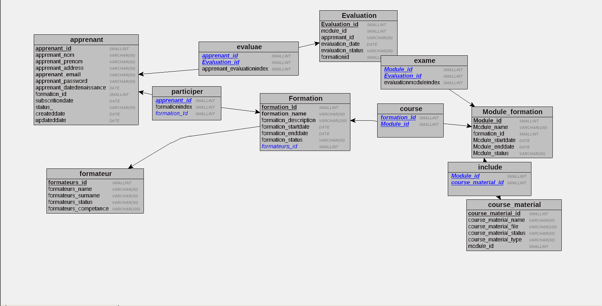

<p align="center">
  <a href="" target="blank"></a>
</p>

[circleci-image]: https://img.shields.io/circleci/build/github/nestjs/nest/master?token=abc123def456
[circleci-url]: https://circleci.com/gh/nestjs/nest

  <p align="center">Une méthodologie de modélisation à usage général dans le domaine du
développement de systèmes d’information.</p>
    <p align="center">
<a href="#" target="_blank"></a>
 
</p>
   

## Description

Merise est une méthodologie de modélisation à usage général dans le domaine du
développement de systèmes d’information, du génie logiciel et de la gestion de projet.
Introduit pour la première fois au début des années 1980, il était largement utilisé en France.
Il a été développé et perfectionné à un point tel que la plupart des grandes organisations
gouvernementales, commerciales et industrielles françaises l'ont adopté.

## Trois cycles fondamentaux 

```bash
 
MERISE présente dans sa démarche d’analyse trois cycles fondamentaux :
    - le cycle d’abstraction,
    - le cycle de vie (de developpement),
    - le cycle de décision.
  
```
  <p align = 'center' > </P>

## Le Dictionnaire de Données
  Le dictionnaire des données est un document qui regroupe toutes les données que vous aurez à conserver dans votre base (et qui figureront donc dans le MCD). Pour chaque donnée, il indique :

    - Le code mnémonique : il s'agit d'un libellé désignant une donnée (par exemple «titre_l» pour le titre d'un livre)

    - La désignation : il s'agit d'une mention décrivant ce à quoi la donnée correspond (par exemple «titre du livre»)

    - Le type de donnée :

        A ou Alphabétique : lorsque la donnée est uniquement composée de caractères alphabétiques (de 'A' à 'Z' et de 'a' à 'z')

        N ou Numérique : lorsque la donnée est composée uniquement de nombres (entiers ou réels)

        AN ou Alphanumérique : lorsque la donnée peut être composée à la fois de caractères alphabétiques et numériques

        Date : lorsque la donnée est une date (au format AAAA-MM-JJ)

        Booléen : Vrai ou Faux

    La taille : elle s'exprime en nombre de caractères ou de chiffres. Dans le cas d'une date au format AAAA-JJ-MM, on compte également le nombre de caractères, soit 10 caractères. Pour ce qui est du type booléen, nul besoin de préciser la taille (ceci dépend de l'implémentation du SGBDR).

    Et parfois des remarques ou observations complémentaires (par exemple si une donnée est strictement supérieure à 0, etc).
  
  <p align = 'center' > </P>

## Règles de gestion
  

  Une règle de gestion peut représenter une disposition légale, une exigence formulée par un client ou un article de règlement interne. A l'origine des règles de gestion, on trouve souvent de simples observations telles que "les clients appellent un numéro vert pour passer commande". Lors du processus de conception, ces observations sont formulées plus en détails (par exemple, "quelles sont les informations fournies par un client lorsqu'il passe commande ou combien un client peut-il dépenser en fonction du crédit dont il dispose".

  Les règles de gestion complètent vos diagrammes avec des informations qui ne peuvent pas être facilement représentées de façon graphique, et peuvent guider la création d'un modèle. Par exemple, la règle "un employé ne peut appartenir qu'à une seule division à la fois" peut vous aider à créer de façon graphique le lien entre un employé et une division. Les règles de gestion sont générées dans le cadre de la génération intermodèle et peuvent être spécifiées plus en détails dans le modèle généré.
  Il existe trois façons d'utiliser des règles de gestion dans un modèle de données :

    Appliquer des règles de gestion à un objet de modèle comme faisant partie de sa définition (voir Application d'une règle de gestion à un objet de modèle).
    [MPD uniquement] Créer une expression serveur pour une règle de gestion qui peut être générée dans une base de données (voir Création et attachement d'une règle de contrainte).
    [MPD uniquement] Insérer une expression de règle de gestion dans un trigger ou dans un procédure stockée en utilisant les macros .CLIENTEXPRESSION ou .SERVEREXPRESSION macros (voir Variables et macros de MPD).

  Avant de créer des règles de gestion, il peut s'avérer utile de répondre aux questions suivantes :

    Existe-t-il des procédures obligatoires pour mon système ?
    Comment puis-je clairement et de façon concise définir les spécifications pour mon projet ?
    Des contraintes limitent-elles mes choix ?
    C'est règle est-elle une définition, un fait, une formule ou une règle de validation ?


## MCD -Modèle conceptuel des données
  Le modèle conceptuel des données (MCD) a pour but d'écrire de façon formelle les données qui seront utilisées par le système d'information. Il s'agit donc d'une représentation des données, facilement compréhensible, permettant de décrire le système d'information à l'aide d'entités.  

  <p align = 'center' > </P>

  ### Relations et classes de relation

  Une relation (appelée aussi parfois association) représente les liens sémantiques qui peuvent exister entre plusieurs entités. Une classe de relation contient donc toutes les relations de même type (qui relient donc des entités appartenant à des mêmes classes d'entité). Une classe de relation peut lier plus de deux classes d'entité. Voici les dénominations des classes de relation selon le nombre d'intervenants :

    une classe de relation récursive (ou réflexive) relie la même classe d'entité
    une classe de relation binaire relie deux classes d'entité
    une classe de relation ternaire relie trois classes d'entité
    une classe de relation n-aire relie n classes d'entité


## MLD Modèle Logique de Données
  Un modèle logique de données (MLD) est la représentation des données d'un système d'information. Les données sont représentées en prenant en compte le modèle technologique qui sera utilisée pour leur gestion.
    <p align = 'center' > </P>

## MPD Modèle physique des données


Le Modèle Physique de Données est la transformation du MLD dans le format d'une base de données. Dans le MLD, nous avons découvert les tables, les champs, et les clefs. Le MPD est le schéma correspondant à une base de données spécifique : Oracle, MySQL, PostgreSQL, etc... Un MLD pourra générer plusieurs MPD, si vous décidez d'adapter votre base de données à votre client.

Le résultat final sera un script SQL qui permettra de créer la base dans le SGBDR. Ici va apparaître la valeur et longueur des données. Le résultat est beaucoup moins lisible. 

 
  <p align = 'center' > </P>
 
## SQL Script 

  <p align = 'center' > </P>

## Breif

pire2pire.com : Conception BDD avec MERISE

Votre mission est de concevoir la base de données d’une plateforme de formation en ligne nommée pire2pire.com à l'aide de la méthode MERISE.

## Livrables

- Un dépôt Github recensant : 
    - Un README explicite et soigné
    - Une définition de l'acronyme MERISE dans le README.md
    - Un dictionnaire de données
    - Des règles de gestion
    - Un MCD
    - Un MLD
    - Un MPD
    - Un script SQL de la base de données

##  Author

-  Prasanna Balasubramaniyam

 

 
